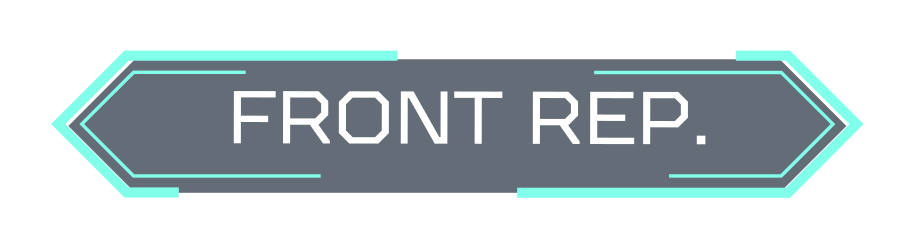
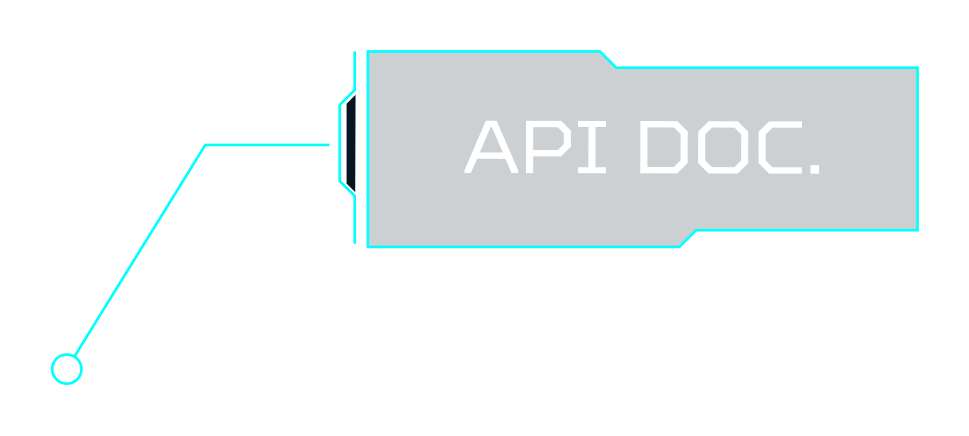

# 
 PROJETO FINAL GAMA ACADEMY 
 
# 
 E-commerce Blue_Tech Eletrônicos 

  
Projeto de conclusão de curso abordando todos os conhecimentos adquiridos durante o bootcamp XP48/49 da Gama Academy. Nesse projeto, elaboramos um e-commerce juntando as duas stacks, front-end e back-end. Dessa forma, foi possível percorrer praticamente todo o processo de desenvolvimento web.
 

  

   

  

## 
índice:
 
<!------ts------->
- [ PROJETO FINAL GAMA ACADEMY ](#-projeto-final-gama-academy-)
- [ E-commerce Blue\_Tech Eletrônicos ](#-e-commerce-blue_tech-eletrônicos-)
  - [índice:](#índice)
  - [Funcionalidades (Back End)](#funcionalidades-back-end)
    - [Usuários](#usuários)
    - [Autenticação](#autenticação)
    - [Categorias](#categorias)
    - [Produtos](#produtos)
    - [Pedidos/Vendas](#pedidosvendas)
  - [Funcionalidades (Front End)](#funcionalidades-front-end)
    - [Autenticação](#autenticação-1)
    - [Painel Administrativo](#painel-administrativo)
    - [Home Page](#home-page)
    - [Página de Listagem de Produtos](#página-de-listagem-de-produtos)
    - [Página Interna de Produtos](#página-interna-de-produtos)
    - [Carrinho de Compras](#carrinho-de-compras)
    - [Página de Pedido feito com Sucesso](#página-de-pedido-feito-com-sucesso)
    - [Página de Pedidos](#página-de-pedidos)
    - [Página de Dados Pessoais](#página-de-dados-pessoais)
  - [Stacks](#stacks)
    - [Back End](#back-end)
    - [Front End](#front-end)
    - [Dependências](#dependências)
  - [Autores:](#autores)
  - [Back End:](#back-end-1)
  - [Front End:](#front-end-1)

<!-------te------>
  

## 
Funcionalidades (Back End)
 

- Cadastrar usuários | categorias | produtos
- Consultar/Listar usuários | categorias | produtos
- Atualizar usuários | categorias | produtos
- Deletar usuários | categorias | produtos
- Fazer Pedidos
- Consultar/Listar Pedido
- Atualizar Pedido
- Cancelar Pedido
  

### Usuários 

Neste projeto, existem dois tipos de usuários: administradores e clientes. Cada tipo de usuário terá acesso a funcionalidades específicas. Os usuários devem ter, no mínimo, os seguintes campos: nome, email, senha e tipo de usuário. 
Haverá uma rota exclusiva para o cadastro de usuários administradores, com a seguinte regra: um novo administrador só pode ser criado por um administrador existente. Para isso, será utilizado o recurso de autenticação JWT, que será desenvolvido nas próximas etapas do projeto. 
Será criada uma rota para cada operação do CRUD. Com exceção da rota de cadastro, todas as demais rotas só poderão ser acessadas por usuários autenticados (JWT).
  

### Autenticação 

O processo de autenticação incluirá uma rota para login, que deverá ter, no mínimo, a opção de login com email e senha. Se as informações fornecidas estiverem corretas, um token JWT será retornado, contendo, no mínimo, as seguintes informações do usuário: identificador, nome, email e tipo de usuário. 
Uma validação baseada nesse token será criada para controlar o acesso às rotas. Dessa forma, será possível identificar o usuário que está realizando a chamada.
  

### Categorias 

Será criado um recurso de categorias para permitir a classificação dos produtos cadastrados no sistema. Haverá uma rota para cada operação do CRUD. Com exceção da rota de listagem de categorias, todas as demais rotas só poderão ser acessadas por um usuário administrador. 
Na criação de uma categoria, haverá a seguinte regra: não será possível cadastrar duas categorias com o mesmo nome.
  

### Produtos 

Haverá uma rota para cada operação do CRUD de produtos. Com exceção da rota de listagem de produtos, todas as demais rotas só poderão ser acessadas por um usuário administrador. As informações mínimas de um produto incluem: nome, foto, preço, descrição e categoria. 
A rota de listagem de produtos exibirá informações completas sobre a categoria do produto, não apenas seu identificador.
  

### Pedidos/Vendas 

Haverá uma rota para cada operação do CRUD de pedidos/vendas. Com exceção da rota de listagem de pedidos, todas as demais rotas só poderão ser acessadas por um usuário logado, independentemente do tipo de usuário. As informações mínimas de um pedido/venda incluem: identificador da venda, usuário que está realizando a compra, lista de produtos selecionados pelo usuário e valor total da venda.
  
 
## 
Funcionalidades (Front End)
 

### Autenticação 

Haverá uma página de login que solicitará informações para autenticar o usuário, independentemente de seu tipo (Administrador ou Cliente). Após a autenticação bem-sucedida, o usuário será redirecionado para a página inicial. Caso o usuário seja um administrador, um link para acesso ao painel administrativo será habilitado no menu da página inicial. Além disso, o usuário permanecerá autenticado durante o período de validade do token.
  

### Painel Administrativo 

Dentro do painel de controle administrativo, existirão páginas contendo formulários e listagens de informações para cada entidade presente em nosso sistema: Produtos, Categorias, Clientes e Pedidos. O objetivo é possibilitar o gerenciamento de cada operação do CRUD através de interfaces intuitivas. É importante enfatizar que somente usuários com privilégios administrativos têm permissão para acessar o painel de controle. Caso um usuário cliente tente acessar esta página, ele será redirecionado automaticamente para a página inicial.
  

### Home Page 

A página inicial será a primeira página exibida ao acessar a aplicação. Ela apresentará uma lista dinâmica de produtos, com informações obtidas diretamente do banco de dados. Além disso, haverá um menu de navegação para orientar o usuário para outras rotas e um rodapé contendo informações sobre a loja.
  

### Página de Listagem de Produtos 

Esta página apresentará uma lista dos produtos cadastrados no sistema, exibindo informações básicas como foto, preço e nome do produto. A página contará com um sistema de paginação para evitar a exibição de todos os produtos simultaneamente. Por exemplo, poderão ser exibidos 10 produtos por página.
  

### Página Interna de Produtos 

Esta página exibirá informações detalhadas sobre um produto específico. Além disso, haverá um botão de compra que permitirá ao usuário adicionar o item ao carrinho de compras.
  

### Carrinho de Compras 

A página do carrinho de compras apresentará a lista de produtos selecionados pelo cliente para finalização da compra. Será possível excluir produtos da lista e retornar para adicionar mais itens ao carrinho. Junto ao botão para finalizar o pedido, haverá o valor total do pedido, calculado a partir da soma de todos os itens no carrinho. É importante ressaltar que apenas clientes autenticados poderão finalizar um pedido.
  

### Página de Pedido feito com Sucesso 

A página deve exibir uma página informando que o pedido foi criado com
sucesso, exibindo os itens comprados
  

### Página de Pedidos 

Haverá uma página na qual o cliente poderá visualizar os pedidos realizados por ele. É importante ressaltar que apenas os pedidos feitos pelo próprio cliente serão exibidos e que somente usuários autenticados terão acesso a essa página.
  

### Página de Dados Pessoais 

Haverá uma página na qual o cliente poderá visualizar e alterar seus dados pessoais. É importante ressaltar que apenas usuários autenticados terão acesso a essa página.

  

## 
Stacks
 

### Back End
- [NodeJs](https://nodejs.org/en)
- [Express](https://www.npmjs.com/package/express)
- [JEST](https://jestjs.io/pt-BR/docs/getting-started)
- [Babel](https://babeljs.io/docs)
- [MySql](https://dev.mysql.com/doc/)
- [TypeScript](https://www.typescriptlang.org/) 
- [Google Cloud](https://cloud.google.com/?hl=pt-br) 

  

### Front End

- [HTML](https://developer.mozilla.org/en-US/docs/Web/HTML)
- [CSS](https://www.w3schools.com/css/default.asp)
- [BOOTSTRAP](https://getbootstrap.com/docs/3.4/css/)
- [REACT](https://legacy.reactjs.org/docs/getting-started.html)
- [TypeScript](https://www.typescriptlang.org/) 

  
     
        
### Dependências 

- [Prisma](https://www.prisma.io/)
- [Jsonwebtoken](https://www.npmjs.com/package/jsonwebtoken)
- [dotenv](https://www.npmjs.com/package/dotenv)
- [cors](https://www.npmjs.com/package/@types/cors)
- [node:crypto](https://nodejs.org/api/crypto.html)
- [cookie-parser](https://www.npmjs.com/package/@types/body-parser)
- [multer](https://www.npmjs.com/package/multer)
  

 

## 
Autores:
 

 ## Back End: 
- ### Gandara | XP48 
- ### Abner Papassoni | 9809XP49 
- ### Rayssa Triani | 5281XP49 
- ### Luiz carlos | 5374XP49 

## Front End: 
- ### Gustavo  | 9751XP49 
- ### Matheus Oliveira | 9750XP49 
- ### Raimundo Ferreira | 5607000XP49 
- ### Tiago Jesus | 5282XP49 
- ### Neylor Chaves | 5376XP49 
  

